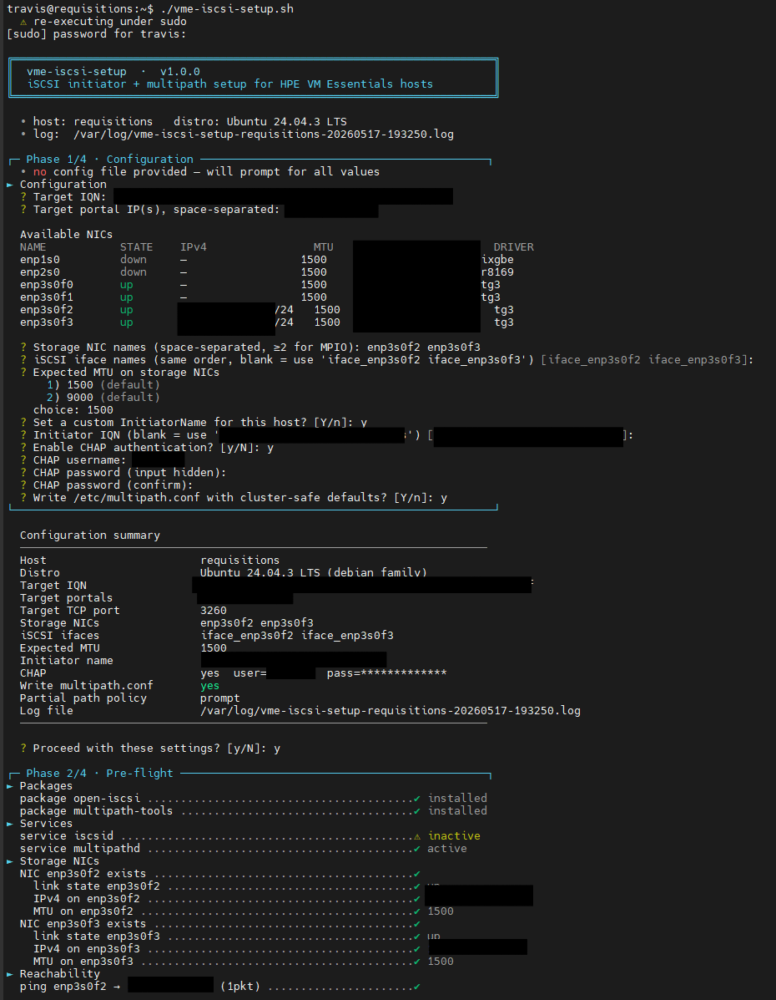
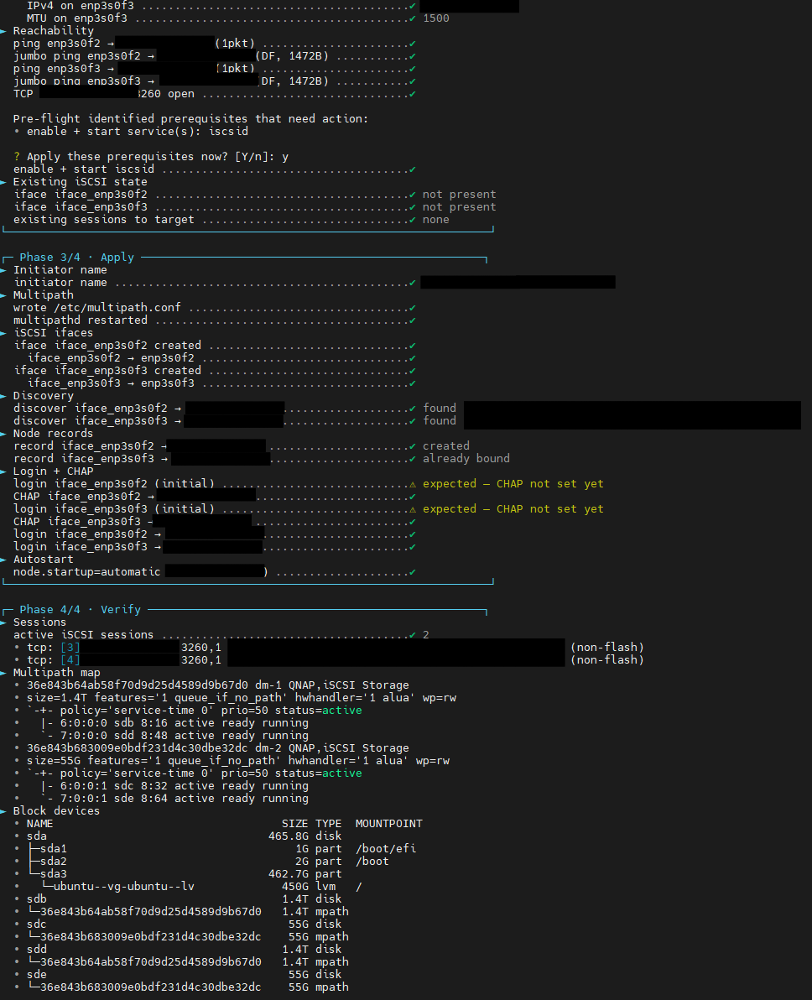
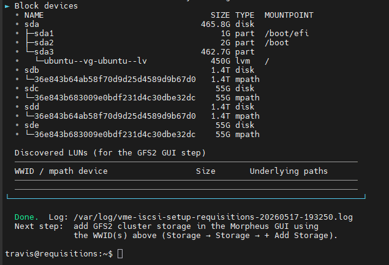
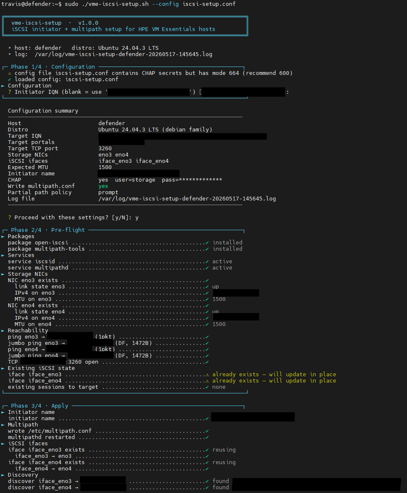
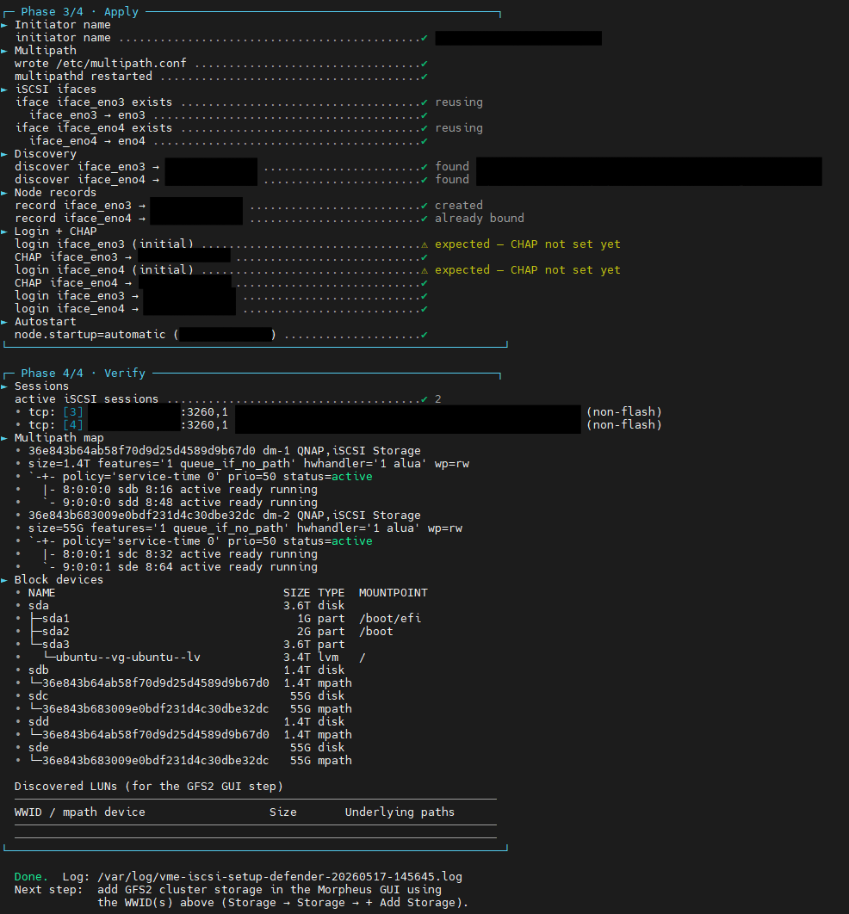

# vme-iscsi-setup

> *"Cluster storage is freedom. And freedom is non-negotiable."*

Automated iSCSI initiator + multipath setup for **HPE VM Essentials** (and any
KVM/libvirt) hosts, in preparation for **GFS2 cluster storage**.

Validates the environment, configures ifaces, performs discovery, applies CHAP
(optional), logs in, sets autostart, and reports WWIDs ready for the GFS2 GUI
step in Morpheus.

Built because doing this by hand across three hosts, twice, in front of a
prod cutover window is a great way to typo your way into a five-hour
incident.

---

## Mission profile

| Phase | What happens |
|------:|--------------|
| **1 · Configuration** | Loads config file (if present), env vars (`ISCSI_CHAP_USER`/`ISCSI_CHAP_PASS`), or prompts interactively. Always ends with a summary table and a `y/N` confirm. |
| **2 · Pre-flight** | Read-only checks: package presence, service state, NIC link / IPv4 / MTU, ping + jumbo-ping with DF bit, TCP 3260 reachable from each NIC × each portal, existing iSCSI state. Asks before installing missing packages. |
| **3 · Apply** | Initiator name → multipath.conf → iSCSI ifaces → single discovery + side-effect cleanup → per-pair node-record reconcile + create → iSCSI tuning → login + CHAP (interleaved per pair) → autostart per pair. Idempotent. |
| **4 · Verify** | `iscsiadm -m session`, `multipath -ll`, `lsblk`, a WWID summary you can copy-paste into the Morpheus GFS2 GUI, and a reboot-persistence check that confirms `iscsid`, `multipathd`, the auto-login oneshot (`iscsi`/`open-iscsi`), and `node.startup=automatic` are all in place. |

---

## Compatibility

- HPE VM Essentials 8.x (tested), and any KVM/libvirt host that uses
  `iscsi-initiator-utils`/`open-iscsi` + `device-mapper-multipath`.
- Distro auto-detected: RHEL/Rocky/Alma/Fedora family **or** Debian/Ubuntu
  family. Package names handled accordingly.
- Bash 4+, GNU coreutils, `iproute2`, `iscsiadm`, `multipath`. The script
  will install the iSCSI / multipath packages if missing (with an explicit
  prompt first).

## Requirements before running

- Root or passwordless sudo.
- Storage NICs already configured with IPs in the storage subnet
  (netplan / NetworkManager / ifcfg). **The script verifies but does not
  configure them.**
- For `--remote-hosts` mode: passwordless SSH + sudo on each remote host,
  and a populated config file (interactive prompts don't work over batch SSH).

---

## Installation

Clone the repository:

```bash
git clone https://github.com/builtbyfood/vme-iscsi-setup.git
cd vme-iscsi-setup
chmod +x vme-iscsi-setup.sh
```

Or grab just the script (and config example) without git:

```bash
curl -LO https://raw.githubusercontent.com/builtbyfood/vme-iscsi-setup/main/vme-iscsi-setup.sh
curl -LO https://raw.githubusercontent.com/builtbyfood/vme-iscsi-setup/main/iscsi-setup.conf.example
chmod +x vme-iscsi-setup.sh
```

The script has no runtime dependencies beyond what `iscsiadm`, `multipath`,
and the standard GNU toolchain provide — drop it on a host and run.

---

## Quick start

```bash
# 1) Inspect the host's NIC inventory to pick storage NICs
sudo ./vme-iscsi-setup.sh --list-nics

# 2) Copy and fill out the config
cp iscsi-setup.conf.example iscsi-setup.conf
$EDITOR iscsi-setup.conf
chmod 600 iscsi-setup.conf       # if you put CHAP secrets in it

# 3) Run on this host
sudo ./vme-iscsi-setup.sh --config iscsi-setup.conf

# Or do the whole cluster from one place:
./vme-iscsi-setup.sh --config iscsi-setup.conf \
    --remote-hosts host-a,host-b,host-c
```

For a fully interactive run with no config file:

```bash
sudo ./vme-iscsi-setup.sh
```

The script will list your NICs, validate IQN and IP formats, prompt for CHAP
credentials with no terminal echo, and refuse to touch anything until you've
seen and confirmed the full summary.

---

## Configuration reference

All keys live in `iscsi-setup.conf`. See `iscsi-setup.conf.example` for the
annotated version.

| Key | Required | Notes |
|---|---|---|
| `TARGET_IQN` | yes | Target IQN, e.g. `iqn.YYYY-MM.com.vendor:array:lun-N`. |
| `TARGET_PORTALS` | yes | Space-separated portal IPs. One for single-controller arrays, two+ for active-active SANs. |
| `TARGET_PORT` | no | Default `3260`. |
| `STORAGE_NICS` | yes | Space-separated NIC names on the host (e.g. `eno3 eno4`). |
| `ISCSI_IFACES` | no | iSCSI iface names. Defaults to `iface_<nicname>`. |
| `NIC_PORTAL_PAIRING` | conditional | Explicit `"nic:portal nic:portal ..."` pairing. Auto-derived positionally when `N == M`, or as fan-out/fan-in when either side is 1. Required only when both sides are ≥2 and unequal. |
| `EXPECTED_MTU` | yes | `1500` or `9000`. Drives jumbo-ping validation. |
| `SET_INITIATOR_NAME` | no | `yes`/`no`. Default `no` (leave existing). |
| `INITIATOR_NAME_OVERRIDE` | no | Override the auto-generated IQN if `SET_INITIATOR_NAME=yes`. |
| `USE_CHAP` | no | `yes`/`no`. Default ask. |
| `CHAP_USER` / `CHAP_PASS` | conditional | Required when `USE_CHAP=yes`, unless supplied via env vars or interactive prompt. |
| `WRITE_MULTIPATH_CONF` | no | `yes` (default for new installs) writes cluster-safe `/etc/multipath.conf` with a backup. `no` verifies the existing file and aborts if `user_friendly_names yes` is set (incompatible with GFS2). |
| `ISCSI_TUNING_PROFILE` | no | `default` (leave OS values), `conservative` (`cmds_max=1024`, `queue_depth=128`), `fast` (`cmds_max=2048`, `queue_depth=256` — for fast all-flash arrays like HPE Alletra MP B1000), or `custom`. |
| `ISCSI_CMDS_MAX` / `ISCSI_QUEUE_DEPTH` | conditional | Required when `ISCSI_TUNING_PROFILE=custom`. Positive integers, `queue_depth <= cmds_max`. |
| `PARTIAL_PATH_POLICY` | no | `prompt` (default), `continue`, or `abort`. Behaviour when one MPIO path works and another doesn't. |

### CHAP secret precedence

1. `ISCSI_CHAP_USER` / `ISCSI_CHAP_PASS` environment variables.
2. Config file values.
3. No-echo interactive prompt (with confirmation).

If you store CHAP secrets in the config file, **`chmod 600` it**. The script
warns you if it isn't.

### NIC ↔ portal pairing

Each storage NIC pairs with **exactly one** target portal — never all portals.
Running discovery and login across every NIC × every portal produces a full
mesh: on a two-NIC host talking to a dual-controller array, that's 4 iSCSI
sessions and 4 multipath paths per LUN, when the correct topology is 2.

The script picks the pairing based on your NIC and portal counts:

| NICs (N) | Portals (M) | Pairing |
|:---:|:---:|---|
| N | N | Positional — `nics[i] ↔ portals[i]` |
| 1 | M ≥ 1 | Single NIC talks to all M portals |
| N ≥ 2 | 1 | All N NICs share the one portal (redundancy to single-controller arrays) |
| N ≥ 2 | M ≥ 2, N ≠ M | Ambiguous — requires explicit `NIC_PORTAL_PAIRING` |

Explicit form (space-separated `nic:portal`):

```
NIC_PORTAL_PAIRING="eno3:10.10.20.10 eno4:10.10.20.11"
```

**Cluster-wide convention worth adopting:** pair lower-numbered NICs with
lower-numbered portals so operator debugging stays consistent across every
host. Not enforced by the script, but it saves an hour the next time
something goes sideways at 2 AM.

The pairing is shown in the summary table before the `Proceed?` confirm — if
it's not what you expected, back out and set `NIC_PORTAL_PAIRING` explicitly.

---

## CLI flags

```
--config FILE         Read settings from FILE (bash key=value).
                      Defaults to ./iscsi-setup.conf if present.
--remote-hosts LIST   Comma-separated hosts. scp's script + config to each
                      and runs over SSH. Requires --config.
--list-nics           Print the NIC inventory for this host and exit.
--non-interactive     Don't prompt. Fail fast on any missing required value.
--no-color            Disable ANSI colour.
-h, --help            Show full help.
-V, --version         Show version.
```

`NO_COLOR=1` environment variable also disables colour.

---

## What the runs look like

The script supports two run styles: **fully interactive** (no config file —
prompts for every value, handy for one-off hosts) and **config-file driven**
(no prompts after the summary confirm — the workflow for cluster rollouts).

### Interactive run


*Phase 1 — interactive prompts for target, NICs, MTU, and CHAP, ending in the summary table. Phase 2 pre-flight begins.*


*Remainder of Phase 2 pre-flight, then Phase 3 Apply running through initiator name → multipath → ifaces → discovery → node records → login + CHAP → autostart, and the start of Phase 4 Verify.*


*Phase 4 — sessions list, multipath map, block devices, and the WWID summary ready to paste into the Morpheus GFS2 GUI.*

### Config-file run


*Phase 1 reads `iscsi-setup.conf` (no prompts), Phase 2 pre-flight runs through, and Phase 3 Apply begins.*


*Remainder of Phase 3 (login + CHAP + autostart) and Phase 4 Verify with the WWID report.*

### Annotated phase-by-phase output

<details>
<summary><b>Phase 2 — Pre-flight</b> (click to expand)</summary>

```
┌─ Phase 2/4 · Pre-flight ────────────────────────────────────────────────┐
► Packages
  package iscsi-initiator-utils ............................. ✓ installed
  package device-mapper-multipath ........................... ✓ installed
► Services
  service iscsid ............................................ ✓ active
  service multipathd ........................................ ✓ active
► Storage NICs
  NIC eno3 exists ........................................... ✓
    link state eno3 ......................................... ✓ up
    IPv4 on eno3 ............................................ ✓ 10.10.20.21/24
    MTU on eno3 ............................................. ✓ 9000
  NIC eno4 exists ........................................... ✓
    link state eno4 ......................................... ✓ up
    IPv4 on eno4 ............................................ ✓ 10.10.20.22/24
    MTU on eno4 ............................................. ✓ 9000
► Reachability
  ping eno3 → 10.10.20.10 (1pkt) ............................ ✓
  jumbo ping eno3 → 10.10.20.10 (DF, 8972B) ................. ✓
  ping eno4 → 10.10.20.10 (1pkt) ............................ ✓
  jumbo ping eno4 → 10.10.20.10 (DF, 8972B) ................. ✓
  TCP 10.10.20.10:3260 open ................................. ✓
► Existing iSCSI state
  iface iface_eno3 .......................................... ✓ not present
  iface iface_eno4 .......................................... ✓ not present
  existing sessions to target ............................... ✓ none
└─────────────────────────────────────────────────────────────────────────┘
```
</details>

<details>
<summary><b>Phase 3 — Apply (with CHAP)</b> (click to expand)</summary>

```
┌─ Phase 3/4 · Apply ─────────────────────────────────────────────────────┐
► Initiator name
  initiator name ............................................ ✓ iqn.2025-01.com.example:host-01
► Multipath
  wrote /etc/multipath.conf ................................. ✓
  multipathd restarted ...................................... ✓
► iSCSI ifaces
  iface iface_eno3 created .................................. ✓
    iface_eno3 → eno3 ....................................... ✓
  iface iface_eno4 created .................................. ✓
    iface_eno4 → eno4 ....................................... ✓
► Discovery
  discover default → 10.10.20.10 ............................ ✓ found iqn...
  portal 10.10.20.10 advertised ............................. ✓
  portal 10.10.20.11 advertised ............................. ✓
► Node records
  reconcile ................................................. ✓ no stale records
  record iface_eno3 → 10.10.20.10 ........................... ✓ created
  record iface_eno4 → 10.10.20.11 ........................... ✓ created
► iSCSI tuning
  iscsid.conf updated ....................................... ✓ cmds_max=2048 queue_depth=256
  iscsid restarted .......................................... ✓
  tuned iface_eno3 → 10.10.20.10 ............................ ✓ cmds=2048 qd=256
  tuned iface_eno4 → 10.10.20.11 ............................ ✓ cmds=2048 qd=256
► Login + CHAP
  login iface_eno3 (initial) ................................ ⚠ expected — CHAP not set yet
  CHAP iface_eno3 → 10.10.20.10 ............................. ✓
  login iface_eno4 (initial) ................................ ⚠ expected — CHAP not set yet
  CHAP iface_eno4 → 10.10.20.11 ............................. ✓
  login iface_eno3 → 10.10.20.10 ............................ ✓
  login iface_eno4 → 10.10.20.11 ............................ ✓
► Autostart
  node.startup=automatic (iface_eno3 → 10.10.20.10) ......... ✓
  node.startup=automatic (iface_eno4 → 10.10.20.11) ......... ✓
└─────────────────────────────────────────────────────────────────────────┘
```

The `⚠ expected — CHAP not set yet` yellow markers on initial logins are
intentional: the script matches the manual procedure's order
(generic `-l -I iface` → set CHAP), then closes out with explicit per-portal
`--login` calls once credentials are written.
</details>

<details>
<summary><b>Phase 4 — Verify</b> (click to expand)</summary>

```
► Sessions
  active iSCSI sessions ..................................... ✓ 2
► Multipath map
► Block devices
  Discovered LUNs (for the GFS2 GUI step)
  ──────────────────────────────────────────────────────────────────────
  WWID / mpath device                  Size       Underlying paths
  ──────────────────────────────────────────────────────────────────────
  3600140589abcdef0123456789abcdef0    4.0T       sdb,sdc
  ──────────────────────────────────────────────────────────────────────

  Done.  Log: /var/log/vme-iscsi-setup-host-01-20250115-104233.log
  Next step:  add GFS2 cluster storage in the Morpheus GUI using
              the WWID(s) above (Storage → Storage → + Add Storage).
```
</details>

Copy the WWID into the Morpheus GUI, do it on each host, then add the GFS2
cluster storage. Every host should report the **same WWID** — that's the
whole point of `user_friendly_names no` in multipath.conf.

---

## Multi-host rollout

```bash
./vme-iscsi-setup.sh \
    --config iscsi-setup.conf \
    --remote-hosts host-a,host-b,host-c
```

What this does:

1. Reads the config locally.
2. For each host: `scp` the script + config to `/tmp/`, `chmod 600` the
   remote config, then `ssh -t` and run with `--non-interactive`.
3. Cleans up the staged files after each host finishes.
4. Aggregates a pass/fail summary at the end.

Requirements: passwordless SSH (`BatchMode=yes`) and passwordless sudo on
every host. CHAP creds come from the config file (because there's no TTY for
the interactive prompt).

---

## Troubleshooting

### Upgrading from v1.1.0 or earlier: mesh reconciliation

v1.1.0 and earlier iterated `(nics × portals)` in discovery, node-record
creation, login, and autostart — which quietly produced a full mesh (2×
expected sessions and paths) on any host with ≥2 NICs and ≥2 portals.
Single-portal setups were unaffected.

v1.2.0 detects and cleans this up automatically. Running the fixed script
against a mesh host will:

1. Enumerate every node record on disk for the target.
2. Compare against the expected pairing.
3. For each stale record: **run a safety gate first** — check that losing
   that iSCSI path would leave every LUN with ≥1 active multipath path.
   Any LUN that would drop to zero paths aborts the reconcile with a clear
   error before touching anything.
4. Logout the live session, delete the record.
5. Continue with the correct pair records.

The safety gate exists because live-mounted GFS2 will withdraw
**cluster-wide** — not just on the local node — the moment a mount loses
all its paths. Never bypass it.

If your production cluster is currently in mesh state and you're not
comfortable letting the script drive the cleanup, the manual runbook is
straightforward: for each host, one node at a time, `pcs cluster standby` →
verify FS unmounted → `iscsiadm --logout` of the wrong-pair sessions →
`iscsiadm -m node -o delete` those records → `pcs cluster unstandby`.

### `iscsiadm: No records found` during CHAP set

Some iscsi-initiator-utils builds don't reliably bind sendtargets-discovered
records to the iface used for discovery — the records land under the
"default" iface and subsequent `-m node -I iface_X` lookups return
`No records found`.

The script handles this in the **Node records** step: after discovery, it
explicitly creates a per-iface node record with `iscsiadm -m node -o new -p
IP:PORT -I iface_X`. That call is idempotent — no-op if the record already
exists, creates it if not.

If you're debugging manually on a host the script set up, this is the form
that works:

```bash
sudo iscsiadm -m node -T <iqn> -p <ip>:3260 -I iface_<nic> --op=show
```

### Jumbo ping fails but standard ping works

MTU mismatch somewhere on the path. Possibilities:

- NIC MTU is 9000 but the upstream switch port isn't trunking jumbo.
- VLAN tagged storage VLAN inherits a lower MTU somewhere.
- The target's NIC isn't set to 9000.

The script keeps going with a warning rather than aborting, but multipath
will perform like garbage in production without end-to-end jumbo. Fix the
plumbing.

### `user_friendly_names yes` in existing multipath.conf

The script refuses to proceed when `WRITE_MULTIPATH_CONF=no` and the existing
file has `user_friendly_names yes`. This is **deliberate** — GFS2 requires
every node in the cluster to see the same `/dev/mapper/<wwid>` path.
Friendly names like `mpatha` are assigned per-host and won't match across
the cluster.

Either let the script write the conf (`WRITE_MULTIPATH_CONF=yes`) or change
it manually.

### Login partially succeeds

If one path comes up and another doesn't, the script honours
`PARTIAL_PATH_POLICY`:

- `prompt` (default) — asks you whether to continue with the working path.
- `continue` — warns and proceeds.
- `abort` — hard stop.

For a brand-new MPIO setup, partial is almost always a network problem (one
NIC has no IP, wrong VLAN, blocked port, etc.) — investigate before
continuing.

### iSCSI queue depth feels too shallow on fast flash

The OS defaults for `iscsid.conf` (`cmds_max=128`, `queue_depth=32`) are
conservative and noticeably bottleneck modern all-flash arrays. Run with
`ISCSI_TUNING_PROFILE=fast` (or `conservative` for a milder bump) and the
script will:

1. Update `/etc/iscsi/iscsid.conf` (backed up to `.bak-<timestamp>`) so any
   future iSCSI targets on the host inherit the higher values.
2. Apply the values directly to the node records for the current target via
   `iscsiadm -m node ... --op=update`, so they take effect at next login on
   this run.
3. Restart `iscsid`.

Live pre-existing sessions retain their original negotiated values until
the next logout/login or reboot — that's protocol behaviour, not a script
limitation.

### Reboot persistence

Four things must be in place for the iSCSI sessions to come back automatically
after a reboot. The Phase 4 **Persistence (reboot survival)** block checks all
four:

| What | Why |
|------|-----|
| `iscsid.service` enabled at boot | The daemon any iscsiadm operation needs. |
| `multipathd.service` enabled at boot | Reassembles the multipath device once both paths log in. |
| `iscsi.service` (RHEL) / `open-iscsi.service` (Debian) enabled at boot | The oneshot that runs `iscsiadm -m node --loginall=automatic` during boot. **Without this enabled, `node.startup=automatic` does nothing.** |
| `node.startup=automatic` set on the node records | Tells the oneshot above which records to log in. |

The preflight phase enables the autologin oneshot if it's missing, and the
Apply phase sets `node.startup=automatic` per portal. If the persistence
block shows any failures, you can manually fix with:

```bash
sudo systemctl enable iscsid multipathd
sudo systemctl enable iscsi          # RHEL/Rocky/Alma/Fedora
sudo systemctl enable open-iscsi     # Debian/Ubuntu
sudo iscsiadm -m node -T <iqn> -p <ip> --op update -n node.startup -v automatic
```

### Logs

Every run writes to `/var/log/vme-iscsi-setup-<hostname>-<timestamp>.log`
(or `/tmp/` if `/var/log` isn't writable). The log captures every iscsiadm
command output, including discovery responses and the on-disk node-record
tree after discovery — gold for postmortems.

---

## Files

```
vme-iscsi-setup.sh         Main script.
iscsi-setup.conf.example   Annotated config template.
README.md                  This file.
LICENSE                    MIT license text.
images/                    Screenshots referenced from this README.
```

---

## Known limitations

- **One target per run.** Configure multiple iSCSI targets by running the
  script once per target. Re-running on the same host with a new target is
  safe — existing ifaces/sessions for prior targets are untouched.
- **No NIC configuration.** Storage NIC IPs / MTU / VLANs must be set at the
  OS level (netplan / NetworkManager / ifcfg) before running. The script
  verifies but does not change them.
- **No target IQN auto-discovery.** You provide the IQN; the script uses
  sendtargets against the portal you specify.
- **Queue depth changes apply at next login.** Live pre-existing iSCSI
  sessions retain their originally negotiated values until logout/login or
  reboot — iSCSI protocol behaviour, not a script limitation.
- **IPv4 portals only.** The IP-format validator only matches IPv4; IPv6
  portals would currently be rejected at the input check even though
  `iscsiadm` itself supports them.

---

## Acknowledgements

- **Sean Jabro** and the HPE team for the [GFS2 datastore configuration
  walkthrough](https://www.hpe.com/emea_europe/en/resource-library.video.configuring-shared-storage-setting-up-and-adding-a-gfs2-datastore.v100006436.html)
  this script automates.
- Community contributors who flagged that the iSCSI defaults
  (`cmds_max=128`, `queue_depth=32`) bottleneck modern flash arrays — that
  feedback became the `ISCSI_TUNING_PROFILE` feature in v1.1.0.
- Community feedback on a six-host VME 8+ cluster with a dual-portal QNAP
  target that surfaced the NIC × portal Cartesian-loop bug — that report
  became the pair-based topology model and reconciliation logic in v1.2.0.

---

## License

MIT. See [LICENSE](LICENSE) for the full text.

---

## Contributing

PRs welcome. If you're submitting a fix for a quirk of a specific array
(QNAP, TrueNAS, Synology, Pure, Nimble, MSA, etc.), please include:

- Array make/model and firmware version
- iscsi-initiator-utils version (`iscsiadm --version`)
- Distro and version
- The actual iscsiadm output before the fix

This makes the workaround obvious to the next person.

---

*For Super Earth. For GFS2. For freedom.*
